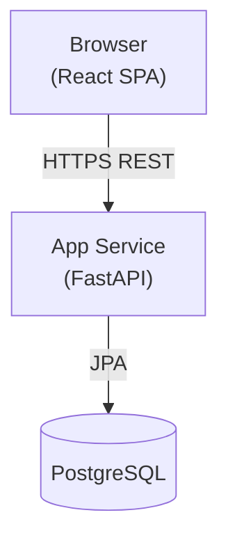
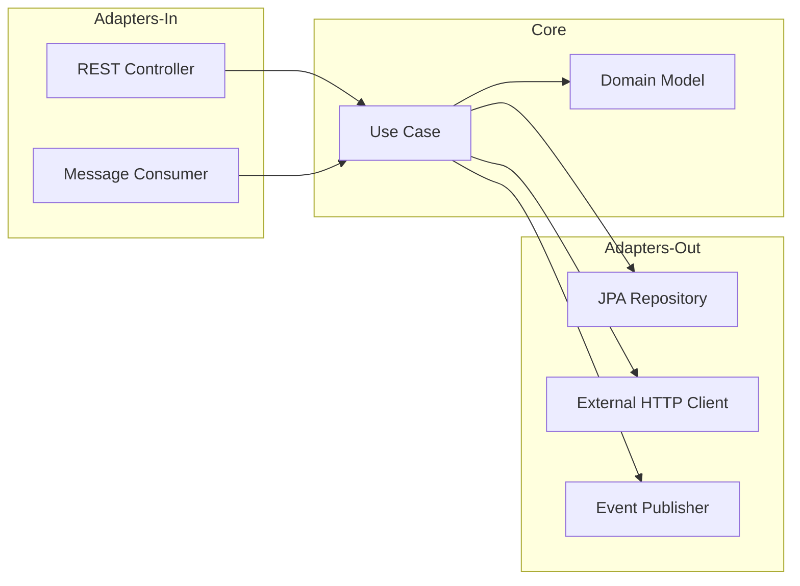
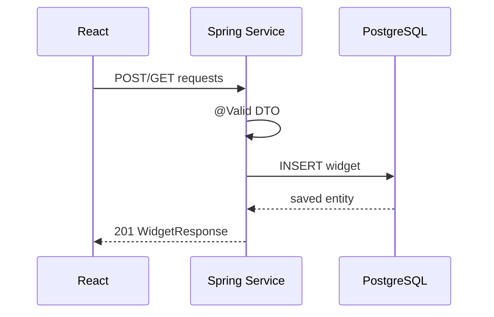
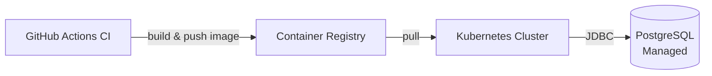

# System Architecture

## High-Level Overview

---

## Hexagonal Architecture (per service)

- **Core** has zero dependency on adapters.
- Ports (interfaces) defined in `core/port/`.

---

## Request Lifecycle

---

## Deployment

- Each service is a Docker image.
- Config via Kubernetes `ConfigMap` + `Secret`.
- Alembic migrations run as a Kubernetes Job on deploy.
