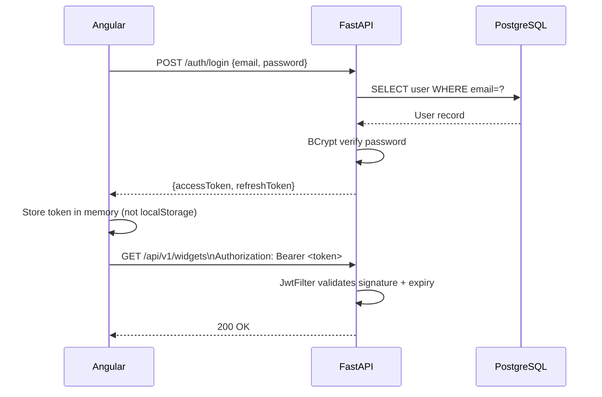
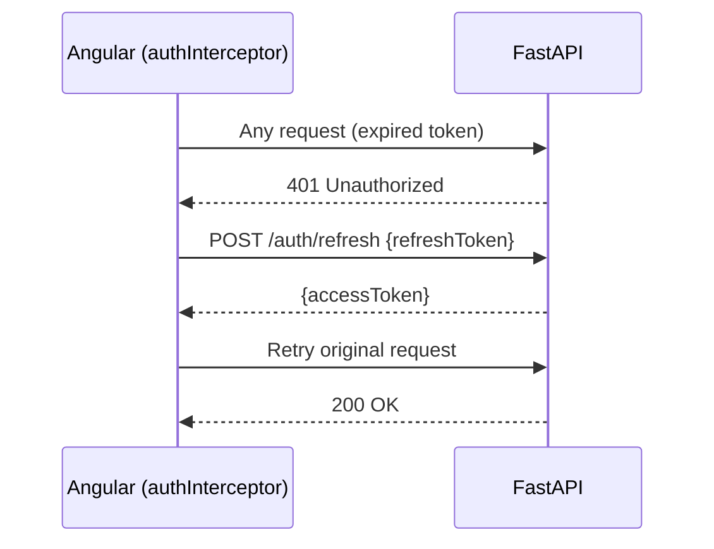
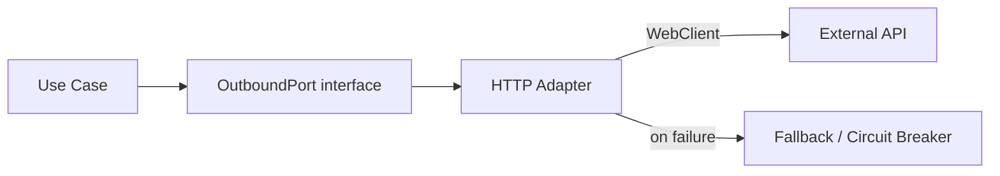

# Integration Flows

## Auth Flow



---

## Token Refresh Flow



---

## Data Mutation Flow (Angular → DB)

```mermaid
flowchart TD
    UI[Component] -->|dispatch action| Store[Zustand + TanStack Query]
    Store -->|rxMethod| Service[Angular Service]
    Service -->|HttpClient POST| API[Spring Controller]
    API -->|@Valid| UseCase[Use Case]
    UseCase -->|save| Repo[JPA Repository]
    Repo -->|SQL INSERT| DB[(PostgreSQL)]
    DB --> Repo --> UseCase --> API
    API -->|201 + body| Service
    Service -->|patchState| Store
    Store -->|signal update| UI
```

---

## External Integration Pattern

For any third-party API:



- All external calls behind an interface (port).
- Use **Resilience4j** `@CircuitBreaker` + `@Retry`.
- Timeouts configured explicitly — never rely on defaults.

```java
@CircuitBreaker(name = "externalService", fallbackMethod = "fallback")
@Retry(name = "externalService")
public ExternalResponse call(Request req) { ... }
```
